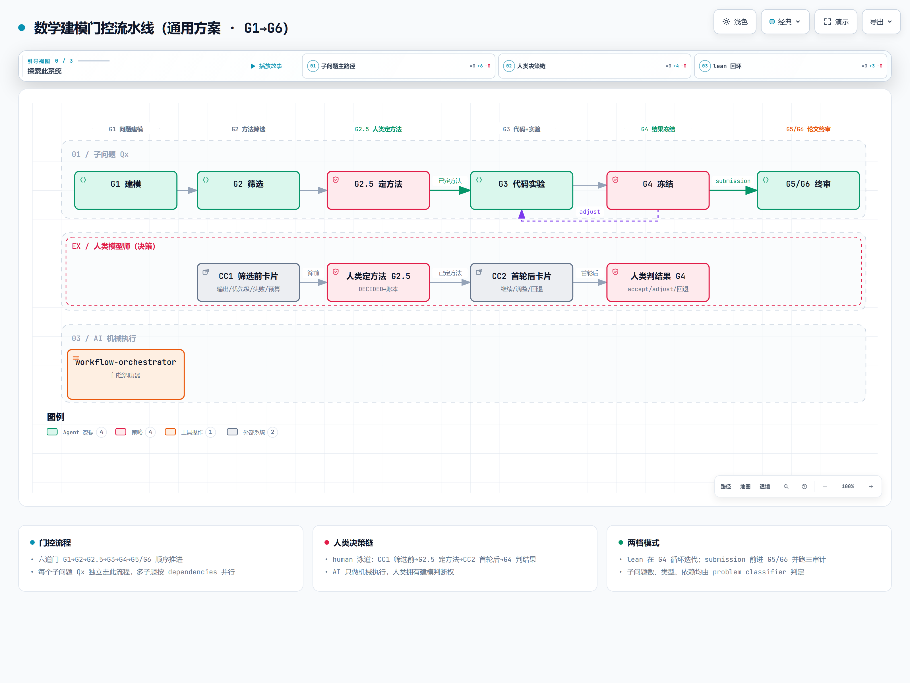

# 数学建模竞赛 AI 工作流技能库

[简体中文](README.md) | [English](README.en.md)

**Math Modeling Skill** — 面向 CUMCM / MCM/ICM 等数学建模竞赛的 Agent 技能库与可执行工作流框架：28 个 Claude/Codex 技能 + 14 个纯标准库校验脚本，把「AI 写代码、人类做决策、一切可复现可审计」变成机器可强制的过程契约。

| 徽章 | 值 |
|---|---|
| 许可 | [MIT](LICENSE) |
| 版本 | 0.4.3（插件 manifest 同步） |
| 运行环境 | Python 3（仅标准库，无第三方依赖） |
| 平台 | Windows / Linux / macOS |
| 测试 | 102 个用例，`python scripts/run_tests.py` 全绿 |

## 目录

- [概述](#概述)
- [功能特性](#功能特性)
- [快速开始](#快速开始)
- [工作流与门禁](#工作流与门禁)
- [技能清单 28 个](#技能清单-28-个)
- [契约体系](#契约体系)
- [命令速查](#命令速查)
- [目录结构](#目录结构)
- [测试覆盖](#测试覆盖)
- [常见问题 FAQ](#常见问题-faq)
- [术语表](#术语表)
- [上游融合](#上游融合)
- [学习与复盘](#学习与复盘)
- [限制与边界](#限制与边界)
- [许可与致谢](#许可与致谢)

## 概述

### 它解决什么问题

数学建模竞赛允许 AI 辅助，但直接让 Agent「自由发挥」会带来两类风险：

1. **AI 越权做建模判断**——替选手选方法、编理由、下结论，违反主办方规则且违背学术诚信；
2. **结果不可信**——代码跑没跑、数字从哪来、版本是否过期，全部无法核对。

### 它的方案

本项目把一次竞赛拆成 6 个门禁关卡（G1–G6），每过一关必须留下可核对的**证据工件**；由 `scripts/` 下的校验器自动检查，门禁只能由证据推动、不能自我声明。同时用 28 个职责单一的技能覆盖从读题到交论文的每一步，AI 与人类分工明确。

### 三条核心原则

| 原则 | 含义 |
|---|---|
| **AI 负责机械正确性** | 解析题目、写代码、跑实验、整理证据、起草论文，均由 AI 完成 |
| **人类拥有建模判断权** | 选方法、判结果、定置信度、物理意义与贡献论述，只能由人类拍板，并留痕 |
| **证据驱动一切** | 门禁、冻结、论文数字都必须溯源到磁盘上的真实工件与哈希，禁止口头声明 |

## 功能特性

| 能力 | 能做什么 | 防什么 |
|---|---|---|
| 门禁检查（G1–G6） | 由证据自动推导当前门禁，单调推进 | 跳过步骤、篡改 manifest 自封门禁 |
| 决策溯源 | 人类决定以追加式 JSONL 账本留痕，必须绑定用户原话 | AI 摘要冒充人类判断 |
| 实验快照 | 统一运行器记录预算、哈希、命令、环境、返回码 | 结果不可复现、预算缩水却宣称完成 |
| 产物谱系（lineage） | 关键工件携带来源/验证者/哈希，上游变更自动标 STALE | 用过期产物冻结或拼装论文 |
| 独立性验证 | main / baseline / verifier 三角色脚本与运行引用互检 | 假基线、假验证、只读主结果冒充独立 |
| 分层 QA | 机械/语义/溯源/血缘/独立性/人工判断/门禁逐层独立报告 | 局部脚本通过冒充整体放行 |

## 快速开始

```bash
git clone https://github.com/Chickeryxn/chickery-s-math-modeling-skill.git
cd chickery-s-math-modeling-skill
git checkout mathmodeling-new-skeleton
```

用 Codex 或 Claude 打开仓库根目录，把题目与附件放入：

```text
workspace/problem.txt
workspace/data_raw/<题目附件>
```

原始附件只读；清洗副本写入 `workspace/data_clean/`。默认工作流：

```text
problem-parser → problem-classifier → data-auditor-cleaner → workflow-orchestrator
```

会话配置位于 `planning/session_config.json`：`interaction_mode`（`learning`/`speed`）控制提问密度，`rigor_profile`（`lean`/`submission`）控制工件与审计密度；新工作区默认 `learning + lean`，提交前切到 `submission`。

## 工作流与门禁

每次竞赛按子问题（Q1、Q2…）独立推进，每个子问题走同一套门禁。门禁状态由 `scripts/workflow_guard.py derive Qx` 从磁盘证据推导，**manifest 只是缓存，不能自我提升**；门禁必须单调递增。



| 门禁 | 名称 | 通过条件（证据） | 主要产出 |
|---|---|---|---|
| G1 | PROBLEM_FRAMED 问题框架化 | 解析、分类、数据清单、成功标准、人工框架决策齐备 | `planning/parse/`、`planning/classification/` |
| G2 | METHOD_SCREENED 方法筛选 | 方法卡定义主候选+可用基线；风险探针全部 PASS/CONDITIONAL；备选有触发条件 | `methods/Qx/qx_method_card.md`、`probes/risk_probe_summary.json` |
| G2.5 | METHOD_CHOSEN_BY_HUMAN 人工选型 | 决策账本含人类 `DECIDED` 的 `method_choice` 记录（绑定用户原话） | `methods/Qx/qx_decisions.jsonl` |
| G3 | CODE_AND_EXPERIMENT_REVIEWED 代码与实验评审 | 主方法与基线都运行过；run_summary 完整；语言评审五项命名检查通过 | `code/Qx/reviews/`、`results/Qx/experiments/roundN/` |
| G4 | RESULTS_JUDGED_AND_FROZEN 结果判定与冻结 | 结果/稳定性/声明范围人工判定齐备；提交模式下含 solution package 与 `frozen_numbers.json` | `results/Qx/reports/` |
| G5 | PAPER_SECTION_READY 论文章节就绪 | 以 solution package 为唯一素材；数字全部来自冻结；物理解释与贡献由人类确认 | `paper/sections/` |
| G6 | FINAL_AUDIT_PASSED 最终审计 | 一致性、完整性、质检三审全部通过（仅提交模式执行） | `paper/audits/`、`paper/qa_report.md` |

**关键规则**

- 只有 G2 与 G2.5 同时通过，才允许生成模型代码。
- 人工方法、结果、稳定性与声明范围决策，必须记入追加式 JSONL 决策账本，AI 不得代写理由。
- 论文中出现的每个数字必须来自 `results/Qx/reports/frozen_numbers.json`；改数要走「解冻 → 改源头 → 重跑 → 重冻结」并记录变更日志，禁止手改。
- 图分四型：Type 1 诊断图只做内部调试，永不进论文；Type 3/4 才进论文并须通过渲染校验。

更多状态机与证据链图示：[门禁生命周期](docs/diagrams/archify/assets/mm-gate-lifecycle.png) · [28 技能架构](docs/diagrams/archify/assets/mm-workspace-architecture.png) · [文档冻结链](docs/diagrams/archify/assets/mm-document-chain.png)（交互 HTML 为生成物不入库，可按需用 Node 本地再生成，见 `docs/diagrams/archify/README.md`）。

## 技能清单 28 个

技能树在 `.codex/skills/` 与 `.claude/skills/` 各有一份完整独立副本（`plugins/mathmodeling-skills/skills/` 为分发副本）。按流水线分五组：

### 问题理解

| 技能 | 一句话职责 | 主要产物 |
|---|---|---|
| `problem-parser` | 把题目解析为目标、对象、约束、输出、子问题与成功标准 | `planning/parse/problem_parse.json` |
| `problem-classifier` | 按输出与结构分类子问题任务型，暴露需人类裁定的框架歧义 | `planning/classification/problem_classification.json` |
| `related-paper-analyzer` | 只分析用户放在 `workspace/papers/` 的原文，提取可迁移方法线索 | `workspace/papers/related_paper_analysis.md` |
| `data-auditor-cleaner` | 附件映射、数据审计与清洗，产出一份可复用数据画像 | `workspace/data/data_profile.json`、`data_clean/` |

### 方法与决策

| 技能 | 一句话职责 | 主要产物 |
|---|---|---|
| `method-selector` | 组建「主候选+可用基线+≤1 条件备选」并跑方法专属风险探针 | `methods/Qx/qx_method_card.md`、`probes/risk_probe_summary.json` |
| `decision-prompt-builder` | 在真正的建模判断点生成「选择卡」，一次最多 3 问 | 不落盘（返回 choice_card） |
| `modeler-decision-logger` | 把人类原话忠实追加进决策账本，绝不代写理由 | `methods/Qx/qx_decisions.jsonl` |
| `model-assumptions-builder` | 提取与维护全局/方法假设，必要性判定留给人类 | `planning/model_assumptions.md` |
| `symbol-table-builder` | 维护全局符号与单位表，消除跨子问题冲突 | `planning/symbol_table.md` |

### 代码与实验

| 技能 | 一句话职责 | 主要产物 |
|---|---|---|
| `model-code-analyzer` | 把人类批准的方法翻译成语言无关的实现与实验契约 | `code/Qx/qx_code_plan.md` |
| `python-model-code-generator` | 生成并运行最小可复现 Python 主方法与基线 | `code/Qx/*.py`、`run_summary.json` |
| `matlab-model-code-generator` | 生成并运行 MATLAB / 北太天元兼容代码 | `code/matlab/Qx/*.m`、`run_summary.json` |
| `code-reviewer` | 按语言路由到对应评审器 | —（路由） |
| `python-code-reviewer` | 五项命名检查：语法/输入契约/方法对齐/可复现性/输出契约 | `code/Qx/reviews/qx_python_review.json` |
| `matlab-code-reviewer` | 同上 + 工具箱与北太天元兼容性检查 | `code/matlab/Qx/reviews/qx_matlab_review.json` |
| `robustness-checker` | 针对承重假设做扰动、重采样、基线对比等稳健性检验 | `robustness/Qx/qx_robustness_summary.json` |

### 结果与论文

| 技能 | 一句话职责 | 主要产物 |
|---|---|---|
| `result-report-generator` | 把实验工件压缩为决策点证据，不替人类选赢家 | `results/Qx/reports/qx_final_result_analysis.md` |
| `figure-table-planner` | 规划最少的证据性图表（Type 1–4） | `methods/Qx/qx_figure_table_plan.md` |
| `math-figure-generator` | 按统一配色/版式/渲染校验生成出版级图 | `paper/figures/` |
| `final-method-explainer` | 从方法卡/账本/结果生成权威最终方法说明 | `methods/Qx/qx_final_method_explanation.md` |
| `solution-package-builder` | 组装交付包并在人工签核后冻结数字 | `results/Qx/reports/qx_solution_package_for_writer.md`、`frozen_numbers.json` |
| `paper-section-writer` | 只从 solution package 与冻结数字起草论文段落 | `paper/sections/qx.tex` |
| `paper-polisher` | 语法/一致性/过度声明校准（借鉴 nature-polishing 原则） | 润色后的 `paper/sections/` |
| `reference-manager` | 校验引用真实性、生成 BibTeX、标记未验证项 | `paper/refs.bib`、`paper/reference_audit.md` |

### 编排与审计

| 技能 | 一句话职责 | 主要产物 |
|---|---|---|
| `workflow-orchestrator` | 门禁调度器：读状态、算门禁、路由下一步，不亲自建模写码 | `planning/manifests/Qx.json`（状态源） |
| `completeness-auditor` | 按当前 profile 核对交付证据是否存在且未过期 | `paper/audits/completeness_audit.md` |
| `consistency-auditor` | 跨介质核对数字/符号/参数/决策与文件一致性 | `paper/audits/cross_media_consistency_audit.md` |
| `quality-assurance-auditor` | 最终提交级五维审计（流程/证据/方法/论文/呈现） | `paper/qa_report.md` |

## 契约体系

领域无关契约定义在 `schemas/`，由 `scripts/` 中的校验器强制执行；**新题目不得修改 schema**，题目语义写入独立的 `planning/model_contract.json`。

| 契约 | Schema 文件 | 校验器 | 说明 |
|---|---|---|---|
| 模型契约 | `schemas/model_contract.schema.json` | `validate_model_contract.py` | 实体/输入/状态函数/决策变量/约束/目标/评估器/不确定性/验证合同；main、baseline、verifier 必须引用同一合同哈希 |
| 人类决策 | `schemas/decision.schema.json` | `validate_decisions.py` | `DECIDED` 必须含 `source`（`user_answer` + 用户消息 ID + 原话）且时间戳为 ISO-8601 |
| 运行快照 | `schemas/run_snapshot.schema.json` | `create_run_snapshot.py` / `validate_run_snapshot.py` | 计划/实际预算、输入/代码/配置哈希、命令、环境、返回码；成功必须由统一运行器执行 |
| 产物谱系 | `schemas/lineage.schema.json` | `lineage.py` / `validate_artifacts.py` | 来源/验证者/消费者/哈希/决策 ID；上游变更 → 下游 `STALE` |

## 命令速查

| 命令 | 用途 |
|---|---|
| `python scripts/run_tests.py` | 运行全部测试（标准库 unittest，无第三方依赖） |
| `python scripts/validate_repo.py .` | 仓库级完整性总检（技能树、测试、契约、快照、血缘、QA） |
| `python scripts/validate_skill_trees.py .` | 三棵技能树哈希一致性 + 插件 manifest 版本一致 |
| `python scripts/sync_plugin.py . [--check]` | 同步 `.codex/skills/` → `.claude/skills/` 与插件分发副本 |
| `python scripts/workflow_guard.py . derive Q1` | 从证据推导 Q1 当前门禁 |
| `python scripts/workflow_guard.py . require Q1 model_code` | 产出敏感工件前检查门禁（不满足则 GATE_BLOCKED） |
| `python scripts/validate_model_contract.py planning/model_contract.example.json` | 校验模型契约结构并输出合同哈希 |
| `python scripts/validate_decisions.py . methods/Q1/q1_decisions.jsonl` | 校验决策账本（人类溯源、追加式、时间戳） |
| `python scripts/create_run_snapshot.py run . runs/<run_id> --command "python code/main.py" --result-ref results/result.json --validation-ref results/validation.json` | 统一运行器执行实验并生成不可变快照 |
| `python scripts/validate_run_snapshot.py . runs/<run_id>` | 校验快照完整性（成功必须由运行器执行） |
| `python scripts/lineage.py assess . path/to/artifact.lineage.json` | 评估产物血缘 CURRENT/STALE/MISSING |
| `python scripts/validate_artifacts.py . planning/manifests/Q1.json` | 校验 manifest 声明的工件均有 CURRENT 血缘 |
| `python scripts/qa_report.py .` | 生成分层 QA 报告（任何阻塞层缺失即非 PASS） |

详细参数见 [`scripts/README.md`](scripts/README.md)，契约说明见 [`schemas/README.md`](schemas/README.md)。

## 目录结构

```text
.
├── .codex/skills/                 # Codex 技能树（28 个，同步源）
├── .claude/skills/                # Claude 技能树（完整独立副本）
├── plugins/mathmodeling-skills/   # 插件分发包（两个 manifest + 技能副本 + hooks）
├── .agents/plugins/marketplace.json  # marketplace 目录清单
├── AGENTS.md                      # 工作流政策唯一事实来源（门禁/工件/人工决策/冻结/审计）
├── CLAUDE.md                      # Claude 运行规则（Codex 侧由 AGENTS.md 覆盖）
├── planning/                      # 会话配置、parse/classification、manifests、presets、示例契约
├── methods/Qx/                    # 方法卡、决策账本、风险探针、最终方法说明
├── code/                          # 模型代码与评审（code/Qx/、code/matlab/Qx/）
├── results/Qx/                    # 实验轮次、报告、solution package、frozen_numbers.json
├── robustness/Qx/                 # 稳健性证据
├── paper/                         # 论文章节、图、引用与三审报告
├── workspace/                     # problem.txt、data_raw/（只读）、data_clean/、papers/
├── references/                    # 上游知识库（历史决策，advisory，非强制）
├── schemas/                       # 领域无关契约（4 个 schema + 说明）
├── scripts/                       # 14 个纯标准库校验/运行脚本
├── docs/diagrams/archify/         # 通用流程图（PNG/SVG/交互 HTML/JSON 源）
└── tests/                         # 34 个测试用例
```

## 测试覆盖

`python scripts/run_tests.py`（102 个用例，全标准库）覆盖：

- 门禁证据推导与单调迁移（含完整 G1→G6 推进链到 `final_assembly`）
- 人类决策溯源（伪造人类、未注册证据、路径逃逸均被拒绝）
- 运行快照与预算降级（`DEGRADED_SUCCESS`、未由运行器执行的成功被拒）
- 产物血缘与 STALE 传播
- main/baseline/verifier 独立性（共享指标源被拒）
- 模型契约结构、技能树同步、分层 QA
- 三类合成场景（回归 / 排程 / 动态事件）端到端测试
- 风险探针 list/dict 两种结构兼容
- 论文装配（`latex_assembly`：装配/冻结宏转义/非安全值跳过/AI 声明/裸数字扫描）
- 上游资产校验（`validate_upstream_assets`，含 SHA-256 漂移与 NOTICE 交叉）
- AI 痕迹扫描（`ai_trace_checker`，含 `--config` 自定义阈值）
- 摘要质量检查（`abstract_checker`）与学习摘要生成（`learning_summary`）
- 模型质量门（`model_quality_gate`）、泄漏启发式（`leakage_check`）与题目覆盖校验（`claim_coverage`）

## 学习与复盘

- [学习路径](docs/learning-path.md)：6 站路线（读题→框架→选法→实验→论文→审稿视角），讲清每个门禁的"为什么"，配练习与自检——把"机械正确性交给 AI、建模判断练成自己的本事"。
- [赛后复盘](docs/post-contest-review.md)：用决策账本回看"哪些建模判断被结果验证/推翻"，`python scripts/learning_summary.py .` 生成复盘骨架。
- [建模自评](docs/modeling-self-review.md)：G2–G4 间的建模方案自评（假设/复杂度/可解释性/公平性/结果底线）。
- 时间预算模板见 `planning/timeline.md`（72h/96h 六阶段拆解）。

## 常见问题 FAQ

**Q：它能直接替我做题或写论文吗？**
不能。AI 只做机械正确性；方法选择、结果判定、物理解释与贡献论述必须由你决定并留痕——这也是主办方 AI 使用规则的要求。

**Q：需要安装什么依赖？**
零第三方依赖。所有脚本仅用 Python 标准库，`python scripts/run_tests.py` 即可自检。

**Q：Codex 和 Claude 都能用吗？**
能。两棵技能树各自完整独立，内容一致；修改技能时先改 `.codex/skills/` 再运行 `sync_plugin.py` 同步。

**Q：默认分支为什么叫 `mathmodeling-new-skeleton`？**
当前开发主线。克隆后按 README 执行 `git checkout mathmodeling-new-skeleton` 即可。

**Q：为什么我的实验被标记 `DEGRADED_SUCCESS`？**
实际预算低于计划预算（如迭代次数缩水）。该运行仍算成功，但相关稳定性/最优性表述必须降级，不能宣称完成原计划。

**Q：`frozen_numbers.json` 能直接手改吗？**
不能。改数必须：解冻 → 修改源头 → 重跑受影响实验 → 重冻结，并在 `freeze_change_log.md` 记录原因。

**Q：诊断图能放进论文吗？**
Type 1 诊断图只做内部调试，永不进论文；Type 3/4 才可进论文并须通过渲染校验。

**Q：如何扩展或修改技能？**
改 `.codex/skills/<skill>/SKILL.md` 后运行 `python scripts/sync_plugin.py .` 同步另两棵副本，再用 `validate_skill_trees.py` 校验。

**Q：和 XiaoMaColtAI 等上游技能库是什么关系？**
本项目合并了 6 个上游项目（XiaoMaColtAI、CUMCMThesis、Lupynow、nature-skills、sci-box 等）并锁定了 12 项决策；历史记录见 [`references/README.md`](references/README.md)，但现行可执行契约以 `AGENTS.md`、`schemas/`、`scripts/` 为准。

## 术语表

| 术语 | 含义 |
|---|---|
| 门禁（gate） | G1–G6 六道关卡 + G2.5 人工选型点，由证据推导、单调推进 |
| manifest | `planning/manifests/Qx.json`，每子问题的机器可读状态缓存（不能自我提升门禁） |
| canonical evidence | 磁盘上真实存在的权威工件，门禁推导的唯一依据 |
| 风险探针（risk probe） | 方法专属的限时小实验，检查可执行性/数据覆盖/假设/输出退化/扰动/规模 |
| 选择卡（choice card） | 只在建模判断点出现的 2–3 个互斥选项，附后果说明，由人类作答 |
| 决策账本（decision ledger） | `methods/Qx/qx_decisions.jsonl`，追加式 JSONL；`DECIDED` 必须绑定用户原话 |
| 运行快照（run snapshot） | 统一运行器产出的不可变实验记录（预算/哈希/命令/环境/返回码） |
| DEGRADED_SUCCESS | 成功但实际预算低于计划的运行状态，相关声明须降级 |
| 产物谱系（lineage） | 工件的来源/验证者/消费者/哈希记录；上游变更使下游变 `STALE` |
| 模型合同（model contract） | `planning/model_contract.json`，题目专属的实体/约束/目标/评估/验证定义 |
| 冻结数字（frozen numbers） | `frozen_numbers.json`，论文数字唯一真相源，禁止手改 |
| main / baseline / verifier | 主方法 / 可用基线 / 独立验证者，三者角色分离且必须互检独立 |
| rigor profile | `lean`（探索期精简工件）或 `submission`（提交期全量工件与三审） |
| interaction mode | `learning`（多提问、先答后建议）或 `speed`（少提问、可并列建议） |
| preset | 必须显式激活、带版本、advisory 的默认值集，不得覆盖合同或人类决定 |

## 上游融合

本项目在**不改变治理核心**（AGENTS.md / schemas / scripts、G1–G6 门禁、28 技能、零第三方运行时依赖、单一 matplotlib 引擎）的前提下，融合了 6 个上游项目的知识规则层与纯标准库工具层：

| 上游 | 引入内容 | 方式 |
|---|---|---|
| [nature-skills](https://github.com/Yuan1z0825/nature-skills)（Apache-2.0） | 图契约/QA/PALETTE、写作润色规则、统计 P0/P1/P2、结果分配与一致性工具 | 逐字引入至 `references/upstream/`，保留声明 |
| [Lupynow/math-modeling-skills](https://github.com/Lupynow/math-modeling-skills)（MIT） | 去 AI 味规则、四轮自审、句式库、Figure Contract、方法决策矩阵 | 逐字引入，保留版权行 |
| [XiaoMaColtAI/math-modeling-skill](https://github.com/XiaoMaColtAI/math-modeling-skill)（无许可，不复制） | 门禁映射、数值求解稳健性 9 项、复现理念 | clean-room 自写至 `references/upstream/method-index/` |
| [sci-box](https://github.com/jihe520/sci-box)（无许可，不复制） | 图型启发 | clean-room 图模板（`math-figure-generator` references） |
| [CUMCMThesis](https://github.com/latexstudio/CUMCMThesis)（无许可，不 vendor） | 国赛论文模板 | 构建期外部依赖，见 [`docs/paper-build.md`](docs/paper-build.md) |
| [archify](https://github.com/tt-a1i/archify)（MIT） | 流程图生成 | 外部工具 + 已提交生成物（`docs/diagrams/archify/`） |

引入纪律：Apache-2.0 / MIT 内容保留声明与许可文本；无许可证或专有内容（如 XiaoMaColtAI 的 `tools/docx|pdf|xlsx`）一律不复制；网络执行（检索/MCP）与第三方运行时（Node/TeX/Pandoc/LibreOffice）不入核心。校验命令：`python scripts/validate_upstream_assets.py .`。来源与许可证明细见 [`references/upstream/README.md`](references/upstream/README.md)、`LICENSES/` 与 `NOTICE.md`。

## 限制与边界

- 本项目提供的是**工作流模板与执行校验工具**，不声称能阻止一切绕过脚本的直接文件写入。
- 校验器检查的是**已落盘工件**；AI 的诚实性最终仍依赖使用者遵守流程。
- 本项目**不编码 offline/network 策略**；如需离线约束，属环境或用户级配置。
- 门禁与审计是质量保障，不构成对竞赛成绩或论文结论的任何担保。

## 许可与致谢

[MIT License](LICENSE)。合并借鉴了 [XiaoMaColtAI/math-modeling-skill](https://github.com/XiaoMaColtAI/math-modeling-skill)、[latexstudio/CUMCMThesis](https://github.com/latexstudio/CUMCMThesis)、[Lupynow/math-modeling-skills](https://github.com/Lupynow/math-modeling-skills)、[Yuan1z0825/nature-skills](https://github.com/Yuan1z0825/nature-skills)、[jihe520/sci-box](https://github.com/jihe520/sci-box) 等上游项目；流程图由 [tt-a1i/archify](https://github.com/tt-a1i/archify) 生成。详细合并决策见 [`references/README.md`](references/README.md)。
