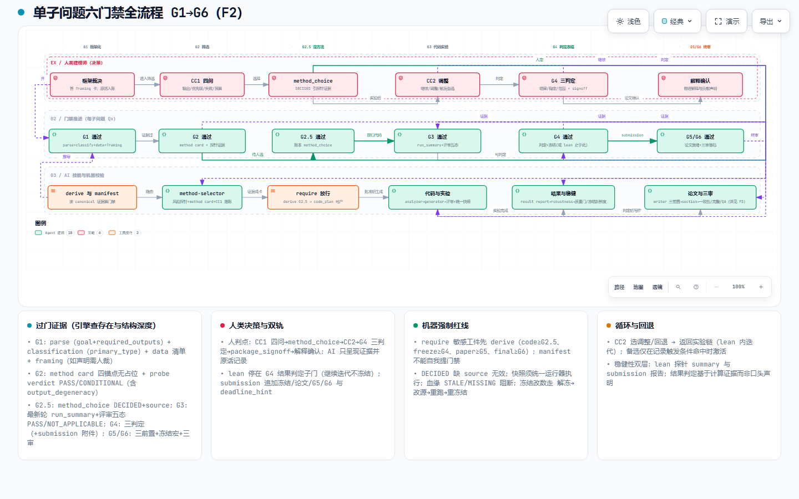
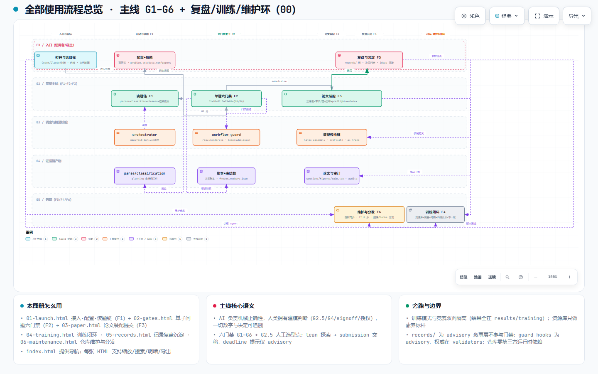
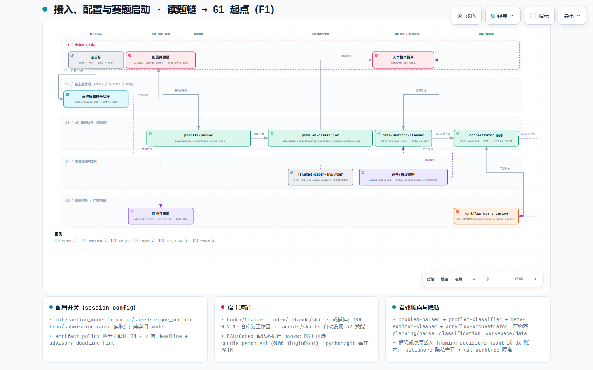
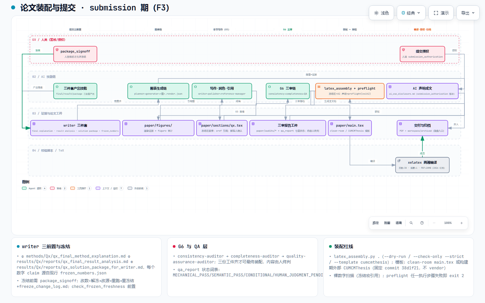
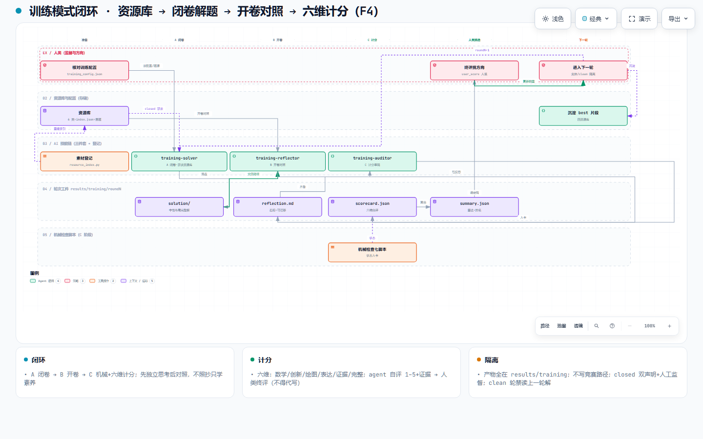
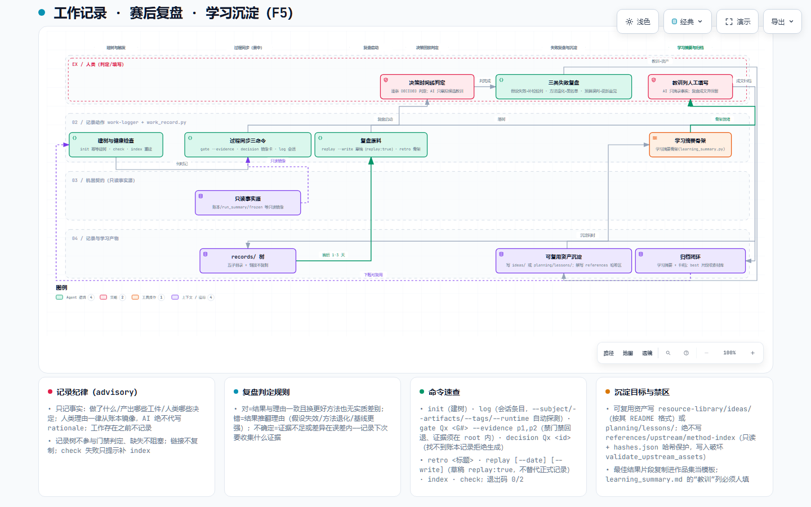
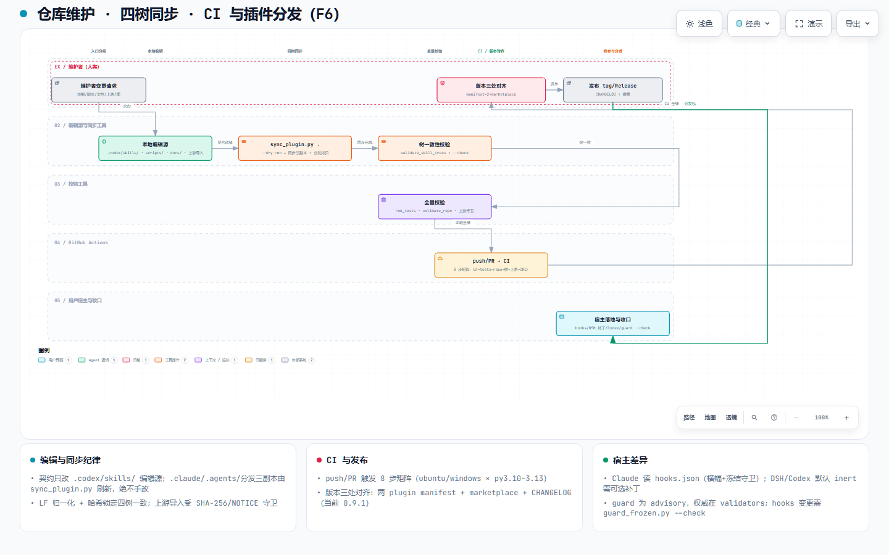

# 数学建模竞赛 AI 工作流技能库

[简体中文](README.md) | [English](README.en.md)

**让 AI 参与建模，但不替你拍板。** AI 负责解析赛题、写代码、跑实验、整理证据、起草论文；你负责选方法、判结果、定置信度、解释物理意义。这个仓库把这套分工固化成 **6 道「证据门禁」（G1–G6）**、32 个技能与 32 个纯标准库脚本，把「AI 写代码、人类做决策、一切可复现可审计」变成机器能强制检查的流程。

| 徽章 | 值 |
|---|---|
| 版本 | [0.10.0](CHANGELOG.md)（插件 manifest 同步） |
| 组成 | 32 个技能 · 32 个纯标准库脚本 · Python 3.10+（零第三方依赖） |
| 平台 | Windows / Linux / macOS |
| CI | [](https://github.com/Chickeryxn/chickery-s-math-modeling-skill/actions/workflows/ci.yml) Ubuntu/Windows × Py 3.10–3.13，281 个用例全绿 |
| 许可 | [MIT](LICENSE) |

## 它解决什么问题

数学建模竞赛已允许 AI 辅助，但直接让 Agent「自由发挥」通常栽在这两点：

| 风险 | 表现 | 后果 |
|---|---|---|
| **AI 越权做判断** | 替你选方法、编理由、下结论 | 方向错了没人拦，论文经不起评委追问 |
| **结果不可信** | 代码没跑过、数字没出处、版本无法核对 | 「我算过了」无法自证，一戳就穿 |

**这个仓库的答案：** 把一次竞赛拆成 6 道可检查的门禁。每过一关，磁盘上必须留下对应的证据文件，由 `scripts/` 里的校验器自动检查——**门禁只能被证据推开，Agent 自己说「过了」不算数。**

## 人和 AI 怎么分工

| 谁 | 做什么 | 怎么保证 |
|---|---|---|
| **AI** | 解析题目、写代码、跑实验、整理证据、起草论文 | 机械活，AI 全包 |
| **你** | 选方法、判结果、定置信度、写物理解释与贡献 | 每项决定记入 `methods/Qx/qx_decisions.jsonl`，须附你的原话，AI 不得代写理由 |
| **证据** | 门禁、冻结、论文数字的最终裁判 | 全部溯源到磁盘真实工件与哈希，口头声明无效 |

这正是各竞赛 AI 使用规则要求的分工：AI 是工具，建模判断与成果负责仍是参赛者本人。

## 6 道门禁怎么运作

<p align="center">
  <a href="https://chickeryxn.github.io/chickery-s-math-modeling-skill/review/02-gates.html"></a><br/>
  <sub>总览：[00-overview.html](https://chickeryxn.github.io/chickery-s-math-modeling-skill/review/00-overview.html) · 门禁交互图：[02-gates.html](https://chickeryxn.github.io/chickery-s-math-modeling-skill/review/02-gates.html)</sub>
</p>

每个子问题（Q1、Q2…）独立走同一套门禁。「谁放行」指该关的决定权在谁手上：

| 门禁 | 做什么 | 谁放行 |
|---|---|---|
| **G1 问题框架化** | 解析赛题、梳理数据、定目标与成功标准 | 你先确认关键框架 |
| **G2 方法筛选** | 产出候选方法卡 + 风险探测（不急着写代码） | AI 先干，探测证据说话 |
| **G2.5 人工选型** | 只有你拍板用什么方法，才允许生成代码 | **你** |
| **G3 代码与实验评审** | 代码能运行、输入输出符合约定、结果可复现 | AI 自检 + 机器校验 |
| **G4 结果判定与冻结** | 你判定结果/稳定性/声明范围，数字冻结进 `frozen_numbers.json` | **你** |
| **G5 论文章节** | 只用冻结数字写作，图通过渲染校验 | AI 起草，你确认物理解释 |
| **G6 最终审计** | 一致性/完整性/QA 三审 | 机器出报告，你终审 |

**几条铁律：**

- **改数必须走流程**：论文里每个数字来自 `results/Qx/reports/frozen_numbers.json`；改数 = 解冻 → 改源头 → 重跑 → 重冻结，并在 `freeze_change_log.md` 记原因，禁止手改。
- **图分四型**：Type 1 只做内部调试，永不进论文；Type 2–4 可进论文，凡进论文的图在 `submission` 模式都须通过渲染校验。
- **G5/G6 只在 `submission` 模式启用**；`lean` 模式下推进到 G4 判定即可。

## 32 个技能一览

按职能分 6 组（完整技能表见 [参考手册](docs/reference.md#技能清单-32-个)）：

| 分组 | 覆盖 |
|---|---|
| 问题理解 | 解析、分类、文献分析、数据清洗 |
| 方法与决策 | 方法筛选、选择卡、决策账本、假设与符号表 |
| 代码与实验 | 代码生成/评审（Python、MATLAB/北太天元）、稳健性 |
| 结果与论文 | 结果报告、图表、方法说明、冻结、论文写作/润色/引用 |
| 编排与审计 | 门禁调度、完整性/一致性/QA 审计、工作记录 |
| 训练模式 | 闭卷求解、素养复盘、多维审核 |

## 训练模式：三步闭环（可选）

想练出 Agent 的高品质建模能力，又不污染真实竞赛？训练产物全部隔离在 `results/training/`，流程三步：

1. **准备**：把赛题放入 `resource-library/assets/problems/`（或改 `planning/training_config.json` 的 `problem_source`）；放入范例素材后运行 `python scripts/resource_index.py .` 重建索引；
2. **三步闭环（每轮 `roundN`）**：`training-solver` 闭卷解题（禁读资源库）→ `training-reflector` 开卷对照、写出差距 → `training-auditor` 跑机械检查并起草六维计分卡（数学 / 创新 / 绘图 / 表达 / 证据 / 完整）；
3. **人工定方向**：你给每维终评（1–5），挑选“下一轮逼近方向”→ 更新 `training_config.json` → 进入下一轮；多轮尽量换题/换数据，clean 轮禁读上一轮解法。

详见 [训练模式手册](docs/training.md)。
## 文档地图

按你的目标选（完整索引见 [docs/](docs/README.md)）：

| 目标 | 文档 |
|---|---|
| 第一次接触，理解「门禁为什么存在」 | [学习路径](docs/learning-path.md) |
| 用 DSH 桌面版跑这套工作流 | [DSH 适配](docs/dsh-compatibility.md) |
| 训练 Agent 的高品质建模能力 | [训练模式](docs/training.md) |
| 构建论文（xelatex + CUMCMThesis） | [论文构建](docs/paper-build.md) |
| 技能全表/命令速查/目录结构/术语表 | [参考手册](docs/reference.md) |
| 0.9.0 审计修复对照（0.9.1 变更见 [CHANGELOG](CHANGELOG.md)） | [审计修复清单](docs/audit-fix-0.9.0.md) |
| 记录每天的建模过程（`records/` 工作记录树，advisory） | [工作记录树](docs/work-record.md) |

## 🎨 交互体验：审阅报告与全流程流程图册

本仓库附带「全量审阅报告 + 交互式流程图册」（[`docs/review/`](docs/review/)）：1 张总览 + 6 张超长分流程图，覆盖**接入与赛题启动 → 单子问题六门禁 G1–G6 → 论文装配与提交 → 赛后复盘沉淀 → 训练闭环 → 仓库维护分发**。

<p align="center">
  <a href="https://chickeryxn.github.io/chickery-s-math-modeling-skill/review/00-overview.html" title="总览全景（交互）"></a>
</p>

| 图 | 交互版 | 静态预览 |
|---|---|---|
| 00 总览全景 | [00-overview.html](https://chickeryxn.github.io/chickery-s-math-modeling-skill/review/00-overview.html) |  |
| F1 接入·配置·赛题启动 | [01-launch.html](https://chickeryxn.github.io/chickery-s-math-modeling-skill/review/01-launch.html) |  |
| F2 单子问题六门禁（主力） | [02-gates.html](https://chickeryxn.github.io/chickery-s-math-modeling-skill/review/02-gates.html) |  |
| F3 论文装配与提交 | [03-paper.html](https://chickeryxn.github.io/chickery-s-math-modeling-skill/review/03-paper.html) |  |
| F4 训练模式闭环 | [04-training.html](https://chickeryxn.github.io/chickery-s-math-modeling-skill/review/04-training.html) |  |
| F5 记录·复盘·沉淀 | [05-records.html](https://chickeryxn.github.io/chickery-s-math-modeling-skill/review/05-records.html) |  |
| F6 维护·同步·分发 | [06-maintenance.html](https://chickeryxn.github.io/chickery-s-math-modeling-skill/review/06-maintenance.html) |  |

> 已由 GitHub Pages 自动部署（[`.github/workflows/pages.yml`](.github/workflows/pages.yml)），点击“交互版”链接即可在浏览器打开；克隆到本地也可双击 `docs/review/index.html`。图集说明见 [`docs/review/README.md`](docs/review/README.md)，完整文字审阅见 [`docs/review/00-审阅报告.md`](docs/review/00-审阅报告.md)。


## 过程日志：工作记录树（可选）

想让每次竞赛留下可回看的过程叙事？仓库提供 `records/` **工作记录树**：会话流水 `sessions/`、门禁迁移 `gates/`、决策卡镜像 `decisions/`、复盘 `retros/`、子问题叙事 `subjects/`，由 `work-logger` 技能配合 `scripts/work_record.py` 维护。它是 **advisory 叙事层**——不参与门禁判定，缺失也不阻塞流程；人类决定仍以 `methods/Qx/qx_decisions.jsonl` 账本为准。

```bash
python scripts/work_record.py init .                     # 首次建树
python scripts/work_record.py log "完成 Q1 实验" --subject Q1   # 记一条会话
python scripts/work_record.py gate Q1 G3 --evidence <工件路径>  # 记门禁迁移
python scripts/work_record.py check .                    # 校验记录树
```

命令与记录纪律详见 [工作记录树手册](docs/work-record.md)。

## 快速开始

```bash
git clone https://github.com/Chickeryxn/chickery-s-math-modeling-skill.git
cd chickery-s-math-modeling-skill
```

克隆后即位于开发分支 `mathmodeling-new-skeleton`（仓库默认分支），无需切换。

1. 用 **Codex / Claude / DeepSeek Harness（DSH）桌面版**打开仓库根目录。
2. 赛题放入 `workspace/problem.txt`，附件放入 `workspace/data_raw/`（原始附件只读；清洗副本由工作流写入 `workspace/data_clean/`）。
3. 环境自检：`python scripts/validate_repo.py .`
4. 让 Agent 按顺序开始：`problem-parser → problem-classifier → data-auditor-cleaner → workflow-orchestrator`。它会一关一关推进，并在该你拍板的地方停下来问你。

两个配置开关（`planning/session_config.json`）：

| 开关 | 取值 | 作用 | 什么时候用 |
|---|---|---|---|
| `interaction_mode` | `learning` / `speed` | 提问密度与建议展示时机 | 新手用 `learning`；熟练后切 `speed` |
| `rigor_profile` | `lean` / `submission` | 工件与审计密度（不改变「人做判断」的边界） | 探索迭代用 `lean`；交稿前切 `submission` |

## 常见问题

- **它能直接替我做题、写论文吗？** 不能，也不该——AI 只承担解析、代码、实验与草稿的机械正确性；方法选择、结果判定、物理解释与提交授权由你拍板并在 `methods/Qx/qx_decisions.jsonl` 留痕（这正是竞赛 AI 规则要求的分工）。
- **需要安装什么？** 零第三方依赖，Python 3.10+ 即可，`python scripts/run_tests.py` 随时自检。
- **第一次怎么跑？** 按「快速开始」四步放题并运行 `python scripts/validate_repo.py .`，默认 `learning + lean` 即可上手（熟练后可切 `speed`，交稿前切 `submission`）。
- **赛题/附件/草稿会误提交吗？** 不会——`.gitignore` 已隔离全部竞赛内容；完全隔离可另用独立目录或 `git worktree`。
- **Codex / Claude / DSH 三套技能怎么维护？** 契约只改 `.codex/skills/` 编辑源，再 `python scripts/sync_plugin.py .` 同步 `.claude/.agents/插件分发` 三份副本并校验四树一致（DSH 经 `.agents/skills/` 自动发现）。
- **`frozen_numbers.json` 能手改吗？** 不能——改数必须“解冻 → 改源头 → 重跑 → 重冻结”并写入 `freeze_change_log.md`。
- **改上游/脚本/README 要注意什么？** 上游内容受 SHA-256 哈希保护（`validate_upstream_assets.py`）；`hooks` 为 advisory 且存在平台差异（见 `docs/dsh-compatibility.md`）；发布前跑 CI 矩阵与 `python scripts/validate_repo.py .`；改动 README 计数或图册时，记得同步 `docs/review/` 与 `test_doc_claims` 守卫。
## 许可与致谢

[MIT License](LICENSE)。融合借鉴了 [XiaoMaColtAI/math-modeling-skill](https://github.com/XiaoMaColtAI/math-modeling-skill)、[latexstudio/CUMCMThesis](https://github.com/latexstudio/CUMCMThesis)、[Lupynow/math-modeling-skills](https://github.com/Lupynow/math-modeling-skills)、[Yuan1z0825/nature-skills](https://github.com/Yuan1z0825/nature-skills)、[jihe520/sci-box](https://github.com/jihe520/sci-box) 等上游项目；流程图由 [tt-a1i/archify](https://github.com/tt-a1i/archify) 生成。详细合并决策见 [references/README.md](references/README.md) 与 [NOTICE.md](NOTICE.md)。
